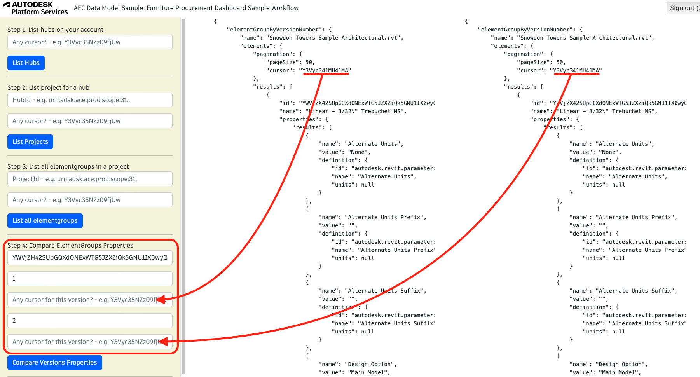

## Compare Designs Sample Workflow

Comparing designs can help architects and designers create more effective and functional buildings that meet the needs of their clients and occupants. By evaluating different options and approaches, they can find innovative solutions and create unique and inspiring spaces.

To run the sample, please review [setup](./README.md#SETUP) instructions.

## Step 1: List all hubs

After login (top-right), click on `List Hubs` and take note of the hubId (`id`). [See C# code](/Controllers/HubsProjects.cs).
In case your hub is not in the first response and you receive a cursor value different that `null`, you can copy and paste this value inside the cursor input and click List Hubs button once more.


## Step 2: List all projects

Use the `HubId` from step 1 to list all projects and take note of the projectId (`id`). [See C# code](/Controllers/HubsProjects.cs).
In case your project is not in the first response and you receive a cursor value different that `null`, you can copy and paste this value inside the cursor input and click List Projects button once more.


## Step 3: List all designs in a project

This step uses `projectId`. Take note of the `designId` of the desired file (in this image, `House.rvt`). [See C# code](/Controllers/Designs.cs).
In case your design is not in the first response and you receive a cursor value different that `null`, you can copy and paste this value inside the cursor input and click List all designs button once more.


## Step 4: Generate versions elements

Use the `designId` from step 3. Click on generate schedule. You may adjust he `version` field. [See C# code](/Controllers/Schedule.cs).
In case your element is not in the first response and you receive a cursor value different that `null`, you can copy and paste this value inside the cursor input and click Compare Versions Properties button once more.



Query used:

```
query getVersionProperties($designId: ID!, $versionNumber: Int!){
	aecDesignByVersionNumber(designId:$designId , versionNumber:$versionNumber ){
		name
		elements{
			pagination{
				pageSize
				cursor
			}
			results{
				id
				name
				properties{
					results{
						name
						value
						propertyDefinition{
							id
							name
							units
						}
					}
				}
			}
		}
	}
}
```

Query used in case a valid cursor is provided:

```
query getVersionProperties($designId: ID!, $versionNumber: Int!){
	aecDesignByVersionNumber(designId:$designId , versionNumber:$versionNumber , pagination:{cursor:"cursor"}){
		name
		elements{
			pagination{
				pageSize
				cursor
			}
			results{
				id
				name
				properties{
					results{
						name
						value
						propertyDefinition{
							id
							name
							units
						}
					}
				}
			}
		}
	}
}
```

The variables are the same in both cases:

```
{
	designId = designId,
	elementsfilter = elementsfilter,
	referencefilter = referencefilter
}
```
