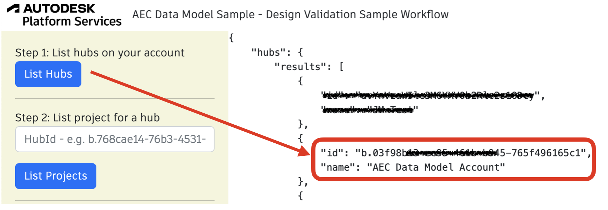
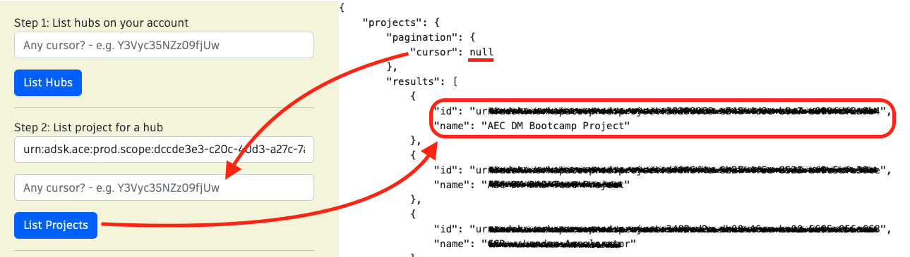
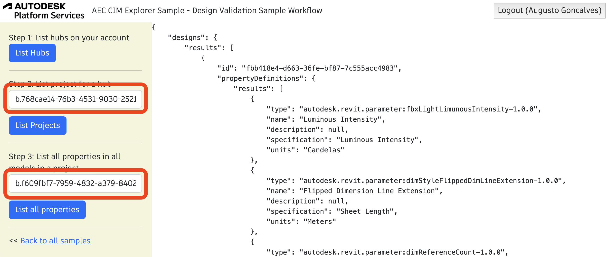

## Design Validation Sample Workflow

Validating data property names, units and types ( used across designs in a project is a valuable QA/QC process that can now be automated using the AEC CIM APIs.

To run the sample, please review [setup](./README.md#SETUP) instructions.

## Step 1: List all hubs

After login (top-right), click on `List Hubs` and take note of the hubId (`id`). [See C# code](/Controllers/HubsProjects.cs). 



## Step 2: List all projects

Use the `HubId` from step 1 to list all projects and take note of the projectId (`id`). [See C# code](/Controllers/HubsProjects.cs). 



## Step 3: List all properties

This step uses `hubId` and `projectId`. Click on List all properties. [See C# code](/Controllers/DesignVaidation.cs). 



Query used:

```
{
  designs(
    filter: {hubId: "b.768cae14-76b3-4531-9030-25212dab4e48", projectId: "b.f609fbf7-7959-4832-a379-84028c470d0c"}
  ) {
    results {
      id
      propertyDefinitions {
        results {
          type
          name
          description
          specification
          units
        }
      }
    }
  }
}
``` 