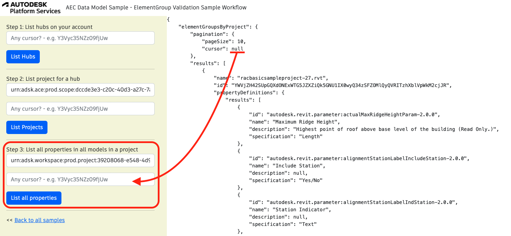

## ElementGroup Validation Sample Workflow

Validating data property names, units and types used across designs in a project is a valuable QA/QC process that can now be automated using the AEC CIM APIs.

To run the sample, please review [setup](./README.md#SETUP) instructions.

## Step 1: List all hubs

After login (top-right), click on `List Hubs` and take note of the hubId (`id`). [See C# code](/Controllers/HubsProjects.cs).
In case your hub is not in the first response and you receive a cursor value different that `null`, you can copy and paste this value inside the cursor input and click List Hubs button once more.


## Step 2: List all projects

Use the `HubId` from step 1 to list all projects and take note of the projectId (`id`). [See C# code](/Controllers/HubsProjects.cs).
In case your project is not in the first response and you receive a cursor value different that `null`, you can copy and paste this value inside the cursor input and click List Hubs button once more.


## Step 3: List all properties

This step uses `projectId`. Click on List all properties. [See C# code](/Controllers/DesignValidation.cs).
In case your elementgroup is not in the first response and you receive a cursor value different that `null`, you can copy and paste this value inside the cursor input and click List Hubs button once more.



Query used in case no cursor is provided:

```
elementGroupsByProject(projectId: $projectId) {
  pagination{
    pageSize
    cursor
  }
  results{
    name
    id
    propertyDefinitions{
      results{
        id
        name
        description
        specification
      }
    }
  }
}
```

Query used in case a valid cursor is provided:

```
elementGroupsByProject(projectId: $projectId, pagination:{cursor:"cursor string here"}) {
  pagination{
    pageSize
    cursor
  }
  results{
    name
    id
    propertyDefinitions{
      results{
        id
        name
        description
        specification
      }
    }
  }
}
```

The variables are the same in both cases:

```
{
  projectId = "Your project ID"
}
```
