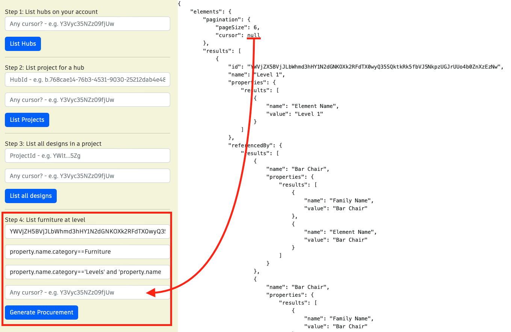

## Furniture Procurement Dashboard Sample Workflow

Obtaining furniture procurement data can help building managers make more informed decisions about budgeting, maintenance, compliance, and planning, which can ultimately lead to a more efficient and effective use of resources.

To run the sample, please review [setup](./README.md#SETUP) instructions.

## Step 1: List all hubs

After login (top-right), click on `List Hubs` and take note of the hubId (`id`). [See C# code](/Controllers/HubsProjects.cs). 


## Step 2: List all projects

Use the `HubId` from step 1 to list all projects and take note of the projectId (`id`). [See C# code](/Controllers/HubsProjects.cs). 


## Step 3: List all designs in a project

This step uses `hubId` and `projectId`. Take note of the `designId` of the desired file (in this image, `House.rvt`). [See C# code](/Controllers/Designs.cs). 


## Step 4: Generate furniture procurement data in a specific level

Use the `designId` from step 3. Click on generate schedule. You may adjust he `filter` field. [See C# code](/Controllers/Schedule.cs). 



Query used:

```
{
	elements (designId: "fbb418e4-d663-36fe-bf87-7c555acc4983",filter:{ query: "metadata.name=='Level 10'"}){
		results{
		id
		name
		referencedBy(name: "hosted", filter:{query:"property.name.category=='furniture'"}){
			results{
				id
				name
				properties(includeReferencesProperties: ""Type""){
					results{
						name
						value
					}
				}
			}
		}
	}
}
```

