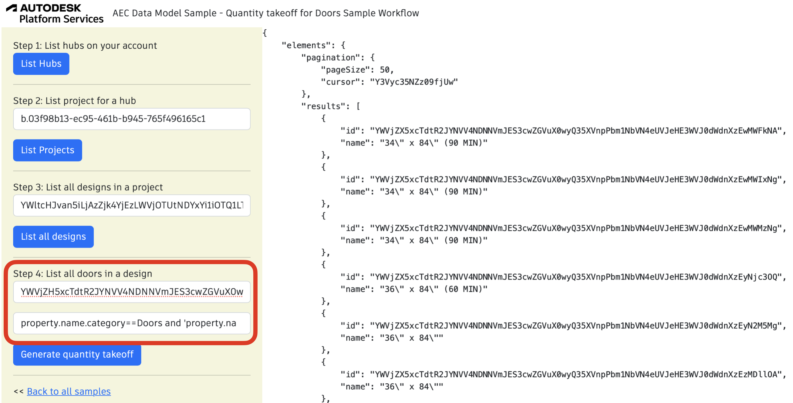

## Quantity takeoff for Doors Sample Workflow

Let's take the sample model and imagine that you would like to build a quantity takeoff for 'Doors'. You will need to get all design entities filtered by classification 'Doors'. 

To run the sample, please review [setup](./README.md#SETUP) instructions.

## Step 1: List all hubs

After login (top-right), click on `List Hubs` and take note of the hubId (`id`). [See C# code](/Controllers/HubsProjects.cs). 


## Step 2: List all projects

Use the `HubId` from step 1 to list all projects and take note of the projectId (`id`). [See C# code](/Controllers/HubsProjects.cs). 


## Step 3: List all designs in a project

This step uses `projectId`. Take note of the `designId` of the desired file (in this image, `House.rvt`). [See C# code](/Controllers/Designs.cs). 


## Step 4: Generate quantity takeoff

Use the `designId` from step 3. Click on generate quantity takeoff. You may adjust he `Category` field. [See C# code](/Controllers/QuantityTakeOff.cs). 



GraphQL query used:

```
elements (designId: "your design id", filter: { query: "property.name.category==Doors and 'property.name.Element Context'==Instance"}) {
  pagination{
      pageSize
      cursor
  }
  results{
    id
    name
  }
}
```