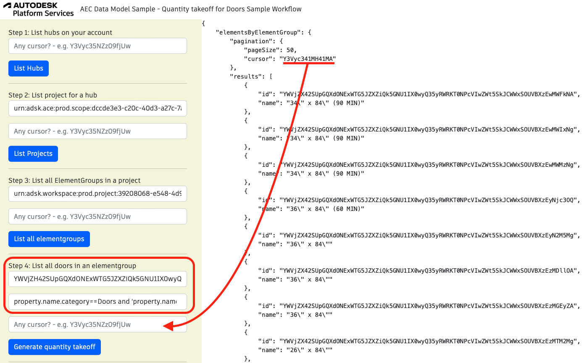

## Quantity takeoff for Doors Sample Workflow

Let's take the sample model and imagine that you would like to build a quantity takeoff for 'Doors'. You will need to get all design entities filtered by classification 'Doors'.

To run the sample, please review [setup](./README.md#SETUP) instructions.

## Step 1: List all hubs

After login (top-right), click on `List Hubs` and take note of the hubId (`id`). [See C# code](/Controllers/HubsProjects.cs).
In case your hub is not in the first response and you receive a cursor value different that `null`, you can copy and paste this value inside the cursor input and click List Hubs button once more.


## Step 2: List all projects

Use the `HubId` from step 1 to list all projects and take note of the projectId (`id`). [See C# code](/Controllers/HubsProjects.cs).
In case your project is not in the first response and you receive a cursor value different that `null`, you can copy and paste this value inside the cursor input and click List Projects button once more.


## Step 3: List all elementgroups in a project

This step uses `projectId`. Take note of the `elementGroupId` of the desired file (in this image, `racadvancedsampleproject-3.rvt`). [See C# code](/Controllers/ElementGroups.cs).
In case your elementgroup is not in the first response and you receive a cursor value different that `null`, you can copy and paste this value inside the cursor input and click List all elementgroups button once more.


## Step 4: Generate quantity takeoff

Use the `elementGroupId` from step 3. Click on generate quantity takeoff. You may adjust he `Category` field. [See C# code](/Controllers/QuantityTakeOff.cs).
In case your element is not in the first response and you receive a cursor value different that `null`, you can copy and paste this value inside the cursor input and click Generate quantity takeoff button once more.



GraphQL query used:

```
query getQuantityTakeoff ($elementGroupId: ID!, $elementsfilter: String!){
  elementsByElementGroup(elementGroupId: $elementGroupId, filter: { query: $elementsfilter}) {
    pagination{
      pageSize
      cursor
    }
    results{
      id
      name
    }
  }
}
```

Query used in case a valid cursor is provided:

```
query getQuantityTakeoff ($elementGroupId: ID!, $elementsfilter: String!){
  elementsByElementGroup(elementGroupId: $elementGroupId, filter: { query: $elementsfilter}, pagination:{cursor:"cursor"}) {
    pagination{
      pageSize
      cursor
    }
    results{
      id
      name
    }
  }
}
```

The variables are the same in both cases:

```
{
  elementGroupId = elementGroupId,
  elementsfilter = elementsfilter
}
```
