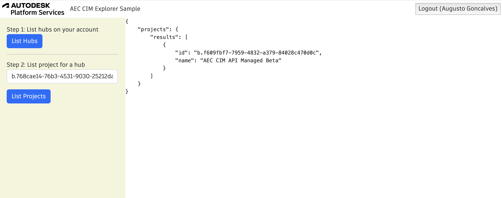

# AEC Data Model Samples in .NET

## Description

This sample demonstrates some basic GraphQL queries for AEC CIM, implementing 3 workflows:

- [Design Validation](./DesignValidation.md)
- [Quantity takeoff](./QuantityTakeOff.md)
- [Schedule](./Schedule.md)

## Setup

### Prerequisites

- [.NET 6 SDK](https://dotnet.microsoft.com/en-us/download/dotnet/6.0) (current LTS)
- [APS credentials](https://forge.autodesk.com/en/docs/oauth/v2/tutorials/create-app) (use `http://localhost:8080/api/auth/callback` as callback URL, take note of you Client ID and Client Secret)
- Provisioned access to [ACC Account](https://forge.autodesk.com/en/docs/bim360/v1/tutorials/getting-started/manage-access-to-docs/) (use Client Id from above)

### Running locally

Install [.NET 6](https://dotnet.microsoft.com/en-us/download) (or newer)

Clone this project or download it. It's recommended to install GitHub desktop. To clone it via command line, use the following (Terminal on MacOSX/Linux, Git Shell on Windows):

	git clone https://github.com/autodesk-platform-services/aps-aecim-samples.git
	
Specify the following environment variables:

Mac OSX/Linux (Terminal)

    dotnet restore
    export APS_CLIENT_ID=<<YOUR CLIENT ID FROM DEVELOPER PORTAL>>
    export APS_CLIENT_SECRET=<<YOUR CLIENT SECRET>>
    export APS_CALLBACK_URL=http://localhost:8080/api/auth/callback
    dotnet run

Windows

    dotnet restore
    set APS_CLIENT_ID =<<YOUR CLIENT ID FROM DEVELOPER PORTAL>>
    set APS_CLIENT_SECRET =<<YOUR CLIENT SECRET>>
    set APS_CALLBACK_URL=http://localhost:8080/api/auth/callback
    dotnet run

> When using [Visual Studio Code](https://code.visualstudio.com),
you can specify the env. variables listed above in a _.env_ file in this
folder, and run & debug the application directly from the editor.

Go to [http://localhost:8080](http://localhost:8080)

## Troubleshooting

General [APS Support form](https://forge.autodesk.com/en/support/get-help).

- [Install .NET on macOS](https://learn.microsoft.com/en-us/dotnet/core/install/macos)

## License

This sample is licensed under the terms of the [MIT License](http://opensource.org/licenses/MIT).
Please see the [LICENSE](LICENSE) file for more details.

## Written by

João Martins, Developer Advocate
