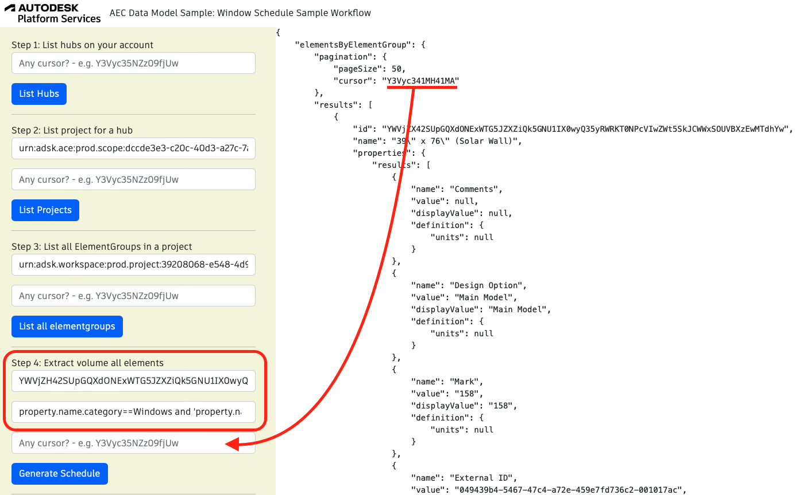

## Window Schedule Sample Workflow

A schedule is typically used to identify, in most cases a chart or table providing descriptions of the windows , doors, finishes, lintels, footings, piers, etc. on a construction project. Let's take the same sample model and imagine that you would like to build a window schedule. You will need to retrieve properties like panel glazing, glass, frame material, height, width, etc. of all design entity instances of category windows.

To run the sample, please review [setup](./README.md#SETUP) instructions.

## Step 1: List all hubs

After login (top-right), click on `List Hubs` and take note of the hubId (`id`).


## Step 2: List all projects

Use the `HubId` from step 1 to list all projects and take note of the projectId (`id`).


## Step 3: List all designs in a project

This step uses `hubId` and `projectId`. Take note of the `designId` of the desired file (in this image, `House.rvt`).


## Step 4: Generate quantity takeoff

Use the `designId` from step 3. Click on generate schedule. You may adjust he `Category` field.



Query used:

```
{
  designEntities(
    filter: {designId: "4e5c860f-ff19-3e2d-8375-89f235be54dd", classificationFilter: {category: "Windows"}}
  ) {
    pagination {
      cursor
      limit
    }
    results {
      id
      classification {
        category
      }
      properties {
        results {
          displayValue
          name
          value
          propertyDefinition {
            description
            groupName
            name
            readOnly
            specification
            type
            units
          }
        }
      }
      referencedBy {
        results {
          id
          classification {
            category
          }
          properties {
            results {
              displayValue
              name
              value
              propertyDefinition {
                description
                groupName
                name
                readOnly
                specification
                type
                units
              }
            }
          }
        }
      }
      references {
        results {
          id
          name
        }
      }
    }
  }
}
```

